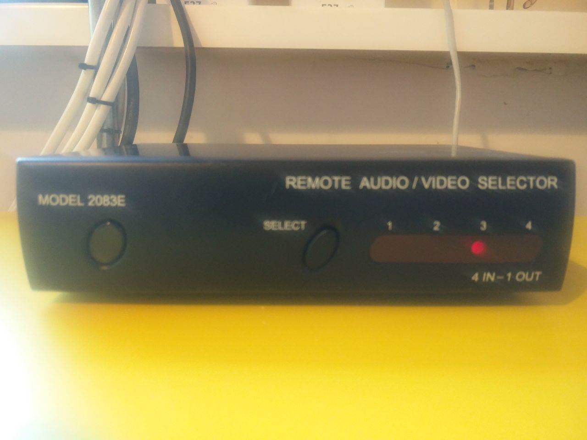
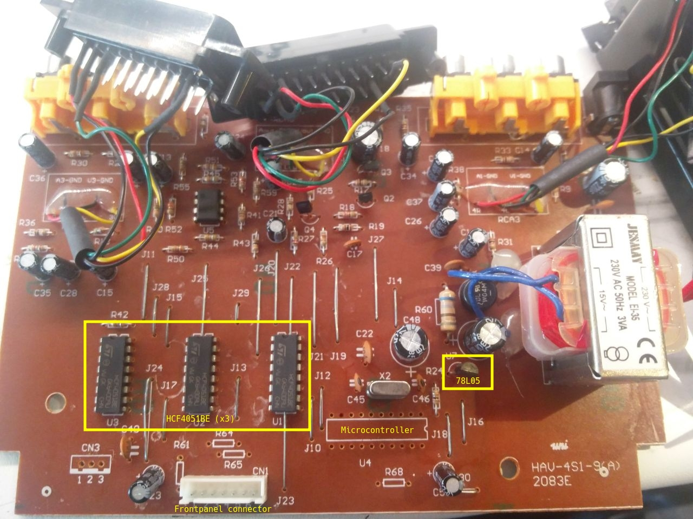
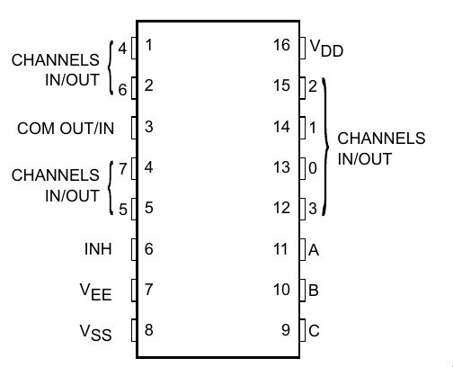
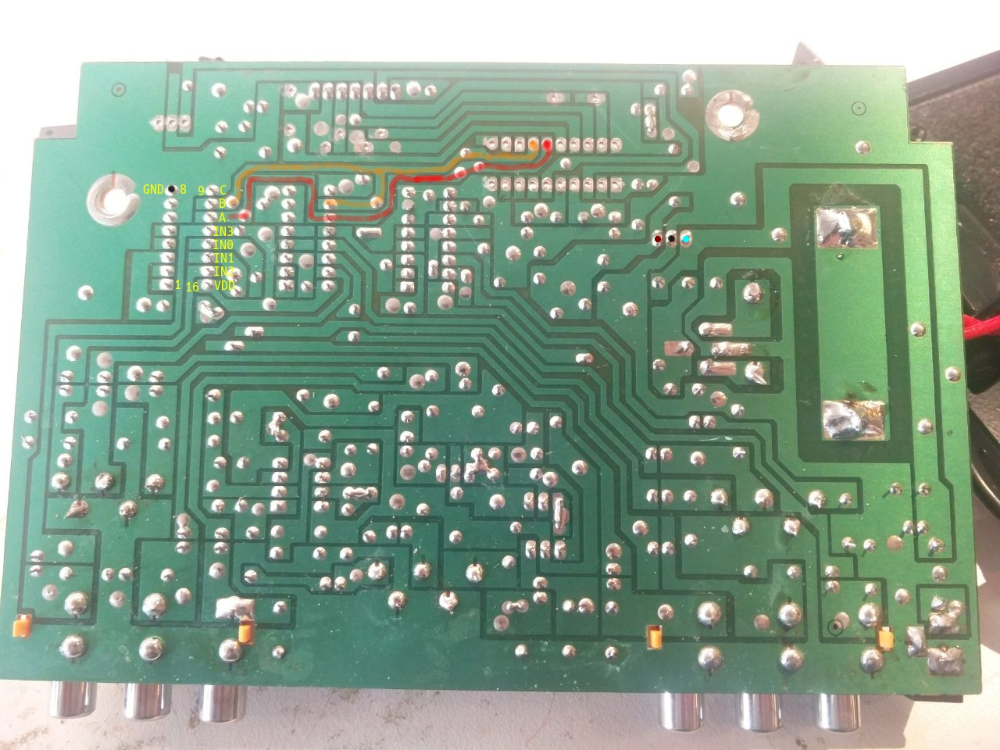
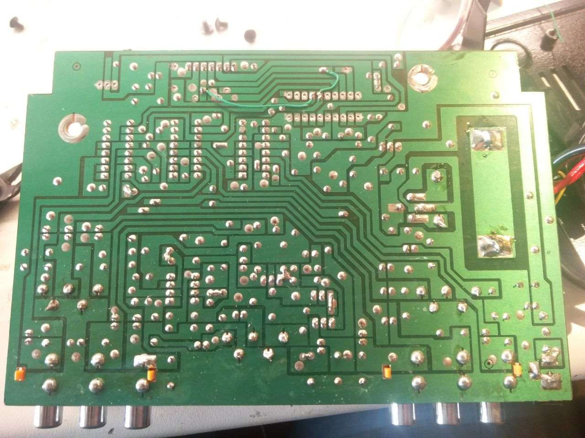
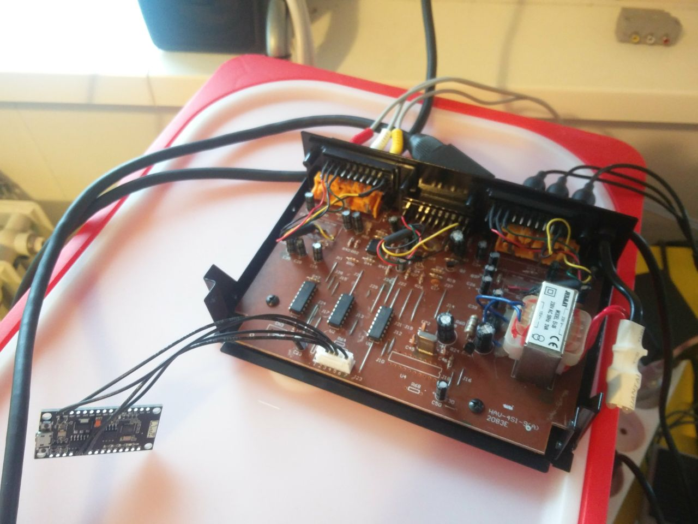
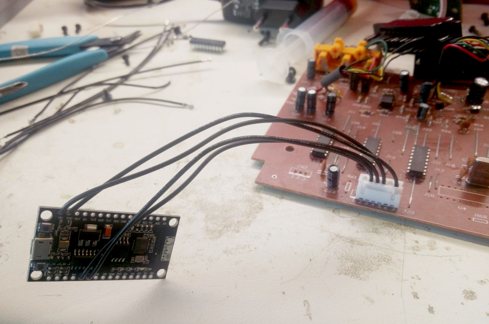

# CyberSCART: the IoT SCART switcher

We connected our SCART switcher to our home automation system using MQTT using an ESP8266.

## The SCART switcher

The SCART switcher we used is a `MODEL 2083E` unit from a thrift store. It has four inputs and one output and can be controlled using a button on the front of the unit and using an IR remote.

After opening it up we noticed that the device uses three `HCF4051BE` analog switchers to select the inputs for both audio (left and right) and video. There was a microcontroller on the board (U4) which controlled the control signals for these switchers. We removed the on-board microcontroller and replaced it with a NodeMCU, which is based around an ESP8266 microcontroller. The NodeMCU is connected to the board using the frontpanel connector, which has been rewired to break out the control signals (A and B) of the three switcher chips. The 5 volt supply of the microcontroller (provided by the LM78L05) was already routed out to the frontpanel connector. This supply is connected to the `Vin` pin of the NodeMCU.

While the conversion process was never fully documented we made some pictures of the board and our modifications.

As a small extra we also connected the frontpanel leds and button to the NodeMCU, allowing the frontpanel to be used as one would expect of the stock unit.

## Software
The software flashed on the NodeMCU allows the unit to connect to our MQTT server. This allows us to integrate the unit with the rest of our home automation system. For example by allowing a user to select an input using our wall mounted tablet.

